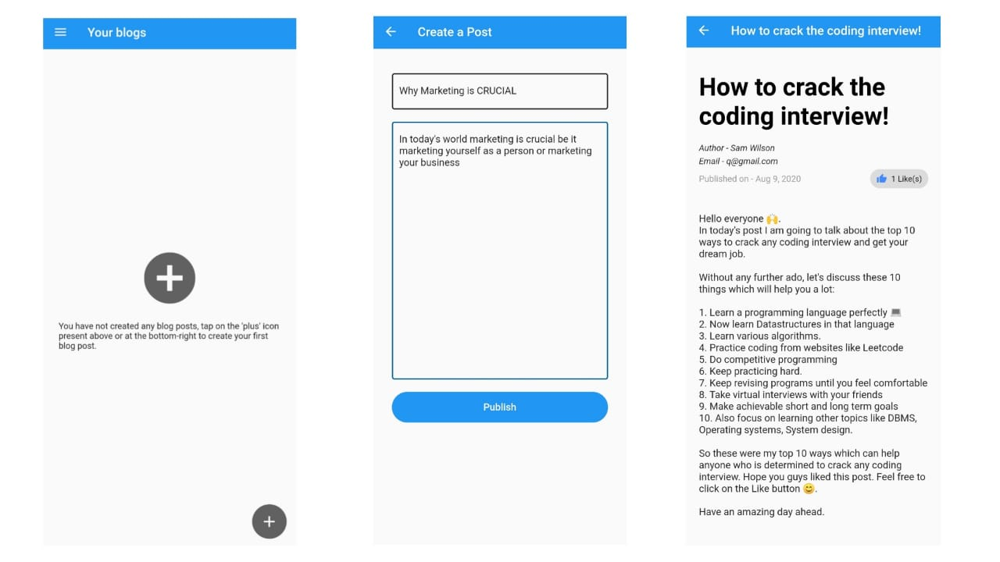
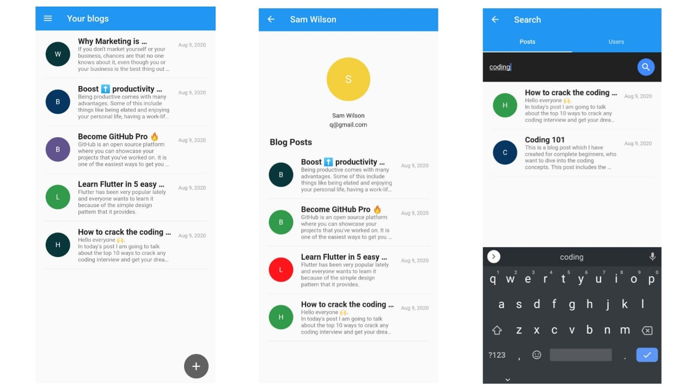

# Atlas
## About
Atlas is a Blogging app made using Flutter and Firebase. Users can register on the app, start creating blog posts about almost anything that comes to their mind. Users can also search for other people present on the app, and the content that they have posted. 

## Snapshots of the application




## Configuration Steps
1. Cloning the repository:

```
$ git clone https://github.com/ahmedgulabkhan/Atlas.git
```

2. Open the project and install dependencies (using terminal):

```
$ cd Atlas
$ flutter pub get
```
This installs all the required dependencies like cloud_firestore, firebase_auth, shared_preferences, etc...

3. Make an android project on your firebase account, follow the mentioned steps and you're good to go.

4. Now run the app on your connected device (using terminal):

`$ flutter run`
